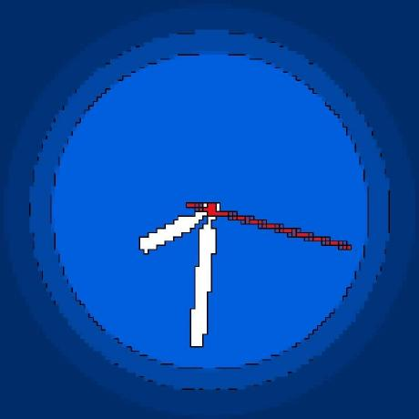

# MiniMind Notes 📝

<div align="center">


[](https://github.com/MLNLP-World/minimind-notes/stargazers)  
[](https://github.com/MLNLP-World/minimind-notes/pulls)  
[](LICENSE)

</div>

<div align="center">

[项目动机](#项目动机) / [项目简介](#项目简介) / [项目资源](#项目资源) / [注释风格与示例](#注释风格与示例) / [原书readme](#原书readme) / [贡献指南](#贡献指南) / [致谢](#致谢)

</div>

---

<h2 id="项目动机">🎯 项目动机</h2>

原项目与地址：[MiniMind](https://github.com/jingyaogong/minimind)  

本项目是对 GitHub 项目 **《MiniMind》** 的 **注释增强版**。在原始代码的基础上，我们补充了逐文件、逐模块的详细中文注释，帮助读者更好地理解大模型的训练流程。  

在整理过程中，我们尽可能保持原始实现的完整性和准确性，同时在注释上进行了适度优化，以更贴合中文学习者的阅读习惯。需要特别说明的是，**原作者才是该项目的主要贡献者**，本仓库仅作为学习辅助资料，不对原内容进行修改或扩展。  

由于个人能力有限，注释中难免存在不完善之处，欢迎大家提出宝贵意见。希望通过这一项目，更多学习者能够快速从“能跑起来”过渡到“能理解、能修改”，也希望为国内社区的大模型学习与研究贡献一份力量。    

---


<h2 id="项目简介">📚 项目简介</h2>

大语言模型（LLMs）已经成为当前人工智能发展的核心驱动力，但对大多数学习者来说，**从零开始理解并实现一个 LLM 的训练流程仍然充满挑战**。  

原始的 [MiniMind](https://github.com/jingyaogong/minimind) 项目提供了一个极轻量的全流程实现：  
- 仅需低成本 GPU，就能在 2 小时内训练一个 26M 参数的 GPT 模型；  
- 覆盖了从 *Tokenizer → Pretrain → SFT → LoRA → DPO → 蒸馏* 的完整链路。  

在此基础上，**MiniMind-Notes** 的定位是：在原项目的实现基础上，补充逐文件、逐模块的详尽注释，帮助学习者降低理解门槛，从而更快掌握训练流程与实现原理。  

### ✨ 本项目的特色
- 每个源码文件包含用途说明、核心原理与特点总结；  
- 函数配备清晰的 docstring 与行内注释；  
- 注释均为中文编写，适合初学者快速上手；  
- 与原仓库保持同步更新，保证可复现性。  

### 💡 通过本项目，你将能够
- 理解从零实现一个 GPT 风格 LLM 的完整流程；  
- 掌握预训练 (Pretrain)、监督微调 (SFT)、LoRA、DPO 等核心环节；  
- 学会如何准备数据集、运行训练、评估模型；  
- 提升源码阅读与理解能力，为后续研究与改进打下基础。  

---

<h2 id="项目资源">📖 项目资源</h2>

- 原版项目地址：[MiniMind](https://github.com/jingyaogong/minimind)  
- 注释增强版：[MiniMind-Notes](https://github.com/MLNLP-World/minimind-notes)  
- 数据集下载：
  - [MiniMind Dataset @ HuggingFace](https://huggingface.co/datasets/jingyaogong/minimind_dataset/tree/main)  
  - [MiniMind Dataset @ ModelScope](https://www.modelscope.cn/datasets/gongjy/minimind_dataset/files)  
- 模型下载：[MiniMind2](https://huggingface.co/jingyaogong/MiniMind2)  

快速体验：
```bash
git clone https://github.com/MLNLP-World/minimind-notes.git

````


---

<h2 id="注释风格与示例">📖 注释风格与示例</h2>


### 🖊️ 注释风格
代码采用 **文件级三段式说明 + 函数 docstring + 关键行内注释**，三者结合，保证既能宏观理解模块作用，又能在细节处快速上手。

### 📝 示例
以下为完整示例，分别展示三种注释形式：
```python
# ===== 1) 文件级三段式说明 =====
文件用途：
  使用 Direct Preference Optimization (DPO) 对 MiniMind 进行偏好对齐训练。

核心原理：
  - 无需 RL 中的奖励模型（RM）和 PPO 复杂流程，直接通过成对偏好数据（chosen/rejected）优化模型。
  - 核心思想：让模型对“人类偏好的回答（chosen）”输出概率高于“不偏好的回答（rejected）”，以参考模型（ref_model）为基准。

特点：
  - 参考模型 ref_model 固定不训练；被训练模型与其对比 log 概率比
  - 支持 AMP 混合精度、DDP 分布式、余弦退火学习率
  - 数据集为成对样本（chosen / rejected），由 DPODataset 提供
  - 仅对 assistant 回复区域计入损失（由 mask 控制）
```
```python
# ===== 2) 函数 docstring 示例 =====
class MOEFeedForward(nn.Module):
    """
    MoE 版本的前馈网络 (FFN)：
      - 训练：按 top-k 将 token 分配给专家并加权合并
      - 推理：按专家分组批量前向（moe_infer，无梯度）
      - 可选 shared_experts：对残差进行额外的共享专家修正
    """
```

```python
# ===== 3) 关键行内注释示例 =====
    def forward(self, x):
        identity = x
        orig_shape = x.shape
        bsz, seq_len, _ = x.shape
        # 1) 门控选择专家
        topk_idx, topk_weight, aux_loss = self.gate(x)
        # 2) 训练/推理两条路径
        x = x.view(-1, x.shape[-1])          # [bs*seq, hidden]
        flat_topk_idx = topk_idx.view(-1)    # [bs*seq*topk]
        if self.training:
            # 训练：复制 token，按专家掩码分别前向，再按权重聚合
            x = x.repeat_interleave(self.config.num_experts_per_tok, dim=0)
            y = torch.empty_like(x, dtype=torch.float16)  # 缓存各专家输出（节省显存）
            for i, expert in enumerate(self.experts):
                y[flat_topk_idx == i] = expert(x[flat_topk_idx == i]).to(y.dtype)
            # 按 topk 权重加权融合
            y = (y.view(*topk_weight.shape, -1) * topk_weight.unsqueeze(-1)).sum(dim=1)
            y = y.view(*orig_shape)
        else:
            # 推理：无梯度 + 分组批量前向，减少小批次 kernel 启动开销
            y = self.moe_infer(x, flat_topk_idx, topk_weight.view(-1, 1)).view(*orig_shape)
        # 3) 共享专家（残差修正）
        if self.config.n_shared_experts > 0:
            for expert in self.shared_experts:
                y = y + expert(identity)
        # 暴露 aux_loss，供上层汇总
        self.aux_loss = aux_loss
        return y
```

---

<h2 id="原书readme">📜 原书readme</h2>

以下为 [MiniMind 官方项目](https://github.com/jingyaogong/minimind) 的核心内容：

> 此开源项目旨在完全从0开始，仅用 **3块钱成本 + 2小时**，即可训练出仅 25.8M 的超小语言模型 MiniMind。
> MiniMind 系列极其轻量，最小版本体积是 GPT-3 的 1/7000，力求做到最普通的个人 GPU 也可快速训练。
> 项目同时开源了从 **Tokenizer → Pretrain → SFT → LoRA → DPO → 蒸馏** 的全过程代码。

### 🔧 快速开始

```bash
git clone https://github.com/jingyaogong/minimind.git
cd minimind
pip install -r requirements.txt
```

下载模型：

```bash
git clone https://huggingface.co/jingyaogong/MiniMind2
```

预训练：

```bash
python trainer/train_pretrain.py
```

监督微调：

```bash
python trainer/train_full_sft.py
```

评估：

```bash
python eval_model.py --model_mode 1
```

### 📂 数据集示例

推荐最小组合：

* `pretrain_hq.jsonl`
* `sft_mini_512.jsonl`

更多数据集详见：[MiniMind Dataset](https://huggingface.co/datasets/jingyaogong/minimind_dataset/tree/main)。

---

<h2 id="贡献指南">🤝 贡献指南</h2>

* 欢迎提交 **更详细的注释**、**学习笔记** 或 **改进建议**。
* 我们的目标是让这个项目成为 **LLM 学习入门的参考手册**。

---

<h2 id="致谢">📝 致谢</h2>

* 原项目作者：[jingyaogong/minimind](https://github.com/jingyaogong/minimind)
* 已参与的贡献者 🙌

<table>
  <tr>
    <td align="center">
      <a href="https://github.com/jingyaogong">
        <br/>
        <sub><b>jingyaogong</b></sub>
      </a>
    </td>
    <td align="center">
      <a href="https://github.com/llm-chaser">
        <br/>
        <sub><b>llm-chaser</b></sub>
      </a>
    </td>
    <td align="center">
      <a href="https://github.com/jiusheng58">
        <br/>
        <sub><b>jiusheng58</b></sub>
      </a>
    </td>
    <td align="center">
      <a href="https://github.com/lul0308">
        <br/>
        <sub><b>lul0308</b></sub>
      </a>
    </td>
    <td align="center">
      <a href="https://github.com/qinzheng-li">
        <br/>
        <sub><b>qinzheng-li</b></sub>
      </a>
    </td>
  </tr>
</table>

---

<h2 id="license">📜 License</h2>

本项目采用 [Apache-2.0 License](LICENSE)。

